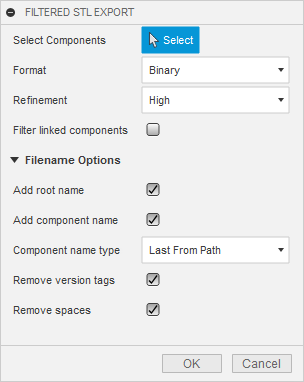

# FilteredExport
Fusion 360 export mechanism do have a all or one mentality. If the user chooses everything Fusion 360 creates sometimes way to many objects and choosing one object could be time extensiv. This add-in solves some of the issues and provides following modules 

Add-in | Description
------------ | -------------
 | Export all or select components body by body as STL without exporting instances of a component.
 | Export all or selected components without exporting instances of a component.
 | Export all or selected components without exporting instances of a component.

# Usage
Each of the modules takes the specific output formats into account and has a different configured.

## Filtered STL Export
The export process is based on the existing export process in Fusion 360, but does not server all the available parameters. Triggering the export brings up following dialog:

The dialog is splitted into component selection, STL format and filename configuration:

### Selection
Parameter | Description
------------ | -------------
Select Component | If no components are selected, the add-in processes all components. By selecting one or more components, the export is limited to the selection. The value behind the components shows the number of selected components. The x behind the value can be used to clear the selection.

### STL Format
Parameter | Description
------------ | -------------
Format | Defines if the resulting export contains `binary` or `text` content
Filter linked components | Check to ignore linked components otherwise uncheck
Refinement | The options `high`, `medium` or `low` correspond to the original definition

### Filename configuration
This part is hidden by default and configures the filenames of the export. The default filename looks like `<Root_component_name>-<Component_name>-<Body_name>.stl`. 

Parameter | Description
------------ | -------------
Add root name | If checked the first element of the filename is `<Root component name v[0-9]*>`
Add component name | If checked the `<component name v[0-9]*>` is part of the filename
Remove version tags | If checked version tags matching the pattern ` v[0-9]*` are removed
Remove spaces | Leading and trailing spaces are removed, remaining spaces are replaced with underscores

## Filtered Save Copy As Export
Like the original "Save Copy As" function, this module does not create local files but exports components to the data panel. In addition to this funcitonality it is able to "batch copy" components with some filtering to avoid manual selection or duplicate exports.

Following configuration is possible:

### Selection
Parameter | Description
------------ | -------------
Select Component | If no components are selected, the add-in processes all components. By selecting one or more components, the export is limited to the selection. The value behind the components shows the number of selected components. The x behind the value can be used to clear the selection.

### Filter Type
Parameter | Description
------------ | -------------
Top level | Only top level or selected componetns will be exported. Sub components will not be processed, filtered etc. separetely 
Leaves | If a component contains only bodies and no sub components, it will be exported. If a component contains no bodies but sub-components, the sub component will be exported but not the current component. If a component contains bodies and sub-components, the sub component will be exported but not the current component. The add-in will report a skipped note but those bodies wil never get exported. 
Mixed leaves | Like `Leaves` but if a component contains bodies and sub-components, the sub component will be exported and the current component will be exported. No body gets lost, but duplicates are created

## Filtered Save Copy As Export
UI configuration and filters are the same as the saveCopy function. The only difference is, that ans STP file will be exported. 

# Installation
* Download or clone this repo.  
* Rename the directory to FilteredExport
* Move the folder into your add-ins directory. [Click Here](https://knowledge.autodesk.com/support/fusion-360/troubleshooting/caas/sfdcarticles/sfdcarticles/How-to-install-an-ADD-IN-and-Script-in-Fusion-360.html) for more information 

# Change log
Date | Module | Description
------------ | ------------- | -------------
2019/02/13 | STL Export | Fix #2 - Files will not be exported if they contain a dot (.) in the filename. The API doesn't reports an error. Issue is fixed by replacing dots with two underscores (__)
2018/10/28 | STL Export | Filter / exclude linked components. 
2018/10/28 | ALL |  Add-in throws an error if only the root component is selected. Fixed. 
2018/10/01 | Export STEP/STP | Like Save Copy As but for STEP/STP exports
2018/06/01 | Save Copy As Export | Mixed leaves export added
2018/06/01 | Save Copy As Export | Leaves export added
2018/06/01 | Save Copy As Export | Top level export and basic documentation added
2018/06/01 | STL Export | Reusable code moved to FilteredExportUtil
2018/05/31 | STL Export | Basic documentation added (STL export)
2018/05/31 | STL Export | UI simplified (filenam options are hidden by default, string entry for the export path is replaced with a folder dialog, icons added)
2018/05/31 | STL Export | Filenames are more configurable
2018/05/31 | STL Export | Minor bug fixes and code adjustments

# Known Issues
* If a body has several instances (e.g. the body was source in a pattern feature) each instance will be exported
* Export does not protect existing files. They are overwritten without asking.
* The result message after the `Copy Save As Export` might be prompted and exports are not visible. Synchronization might take some time. Pressing Refresh might speed up the process.

# Wish List
- [x] Add more STL export options
- [x] Imporove STL UI
- [x] Add Documentation
- [x] Add "Save Copy As" option
- [x] Add STP Exprot
- [ ] Add Fusion Archive Export
- [ ] Add project browser for "Save Copy As" option
- [x] Add icons etc. 
